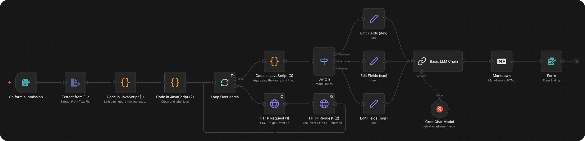

 

  

  <h1 style="margin-top: 2rem; align: center">Mjolnir: Realtime AI-Powered Fraud Detection and Personalized Report Generation from Financial Transaction Logs</h1>

  <h3 align="center">
    A fraud detection and prevention project for <i>Samsung × KBTG Digital Fraud Cybersecurity Hackathon</i>.
     
     
    
  </h3>

## About the Project

Mjolnir is an AI-powered security tool that automates the detection of fraud in financial transaction logs as advanced persistent threats (APT). It uses our fine-tuned BERT model to classify each query as `Normal` or `Anomaly`, along with an LLM to translate technical threats into plain English. Instead of generating generic alerts, it produces personalized reports tailored for managers, developers, and executives, such as CISOs. Mjolnir’s objective is to rapidly detect, prevent, and mitigate the potential damage caused by cyberattacks by automating these processes.

In the future, we aim to improve the system’s accuracy by introducing human-in-the-loop verification to identify cases where the model incorrectly classifies a query, as well as by developing a model that can continually retrain itself using new and corrected data.

> [!NOTE]
> A real-world environment system needs to monitor data 24/7 and automatically alert as soon as an anomaly is detected. It must also generate reports by comparing the oldest and newest entries within an appropriate timeframe. Unfortunately, the current prototype is limited to occasional manual runs with a smaller workload of log excerpts (approximately 200 lines) due to resource constraints.

## Usage

Select an employee type for report personalization. Then, choose a sample query [from the provided list](https://github.com/AungMoonLord/AI-Cybersecurity-Hackathon/tree/main/Sample%20Queries). Soon upon submission, the page will reload with the generated report with an option to copy it.

## Technology Stack

### LLM Models

| Name                                                                                                            | Purpose                                                       |
| --------------------------------------------------------------------------------------------------------------- | ------------------------------------------------------------- |
| [AungMoonLord/bert-log-anomaly-detection](https://huggingface.co/AungMoonLord/bert-log-anomaly-detection)                           | Our fine-tuned classification inference model on transaction logs (more details inside) |
| [meta-llama/llama-4-scout-17b-16e-instruct](https://console.groq.com/docs/model/llama-4-scout-17b-16e-instruct) | Report writing and summarization model                        |

### AI/ML Services

| Name                                                                                             | Purpose                                                                        |
| ------------------------------------------------------------------------------------------------ | ------------------------------------------------------------------------------ |
| [GroqCloud](https://groq.com/groqcloud)                                                          | Run LLM summarization model                                                    |
| [Hugging Face](https://huggingface.co) with [Hugging Face Spaces](https://huggingface.co/spaces) | Store and host the fine-tuned model and run inferences                         |
| [Gradio](https://www.gradio.app)                                                                 | Deploy an interface for the fine-tuned model and connect it to n8n via its API |

### Process Automation

| Name                  | Purpose                                                            |
| --------------------- | ------------------------------------------------------------------ |
| [n8n](https://n8n.io) | Connect various services and handle the entire workflow automation |

View workflow diagram

### Infrastructure

| Name                                            | Purpose                                              |
| ----------------------------------------------- | ---------------------------------------------------- |
| [Google Cloud Server](https://cloud.google.com) | Host the n8n instance on GCP free tier (e2-micro VM) |
| [Docker](https://www.docker.com)                | Run n8n in a containerized environment               |
| [Nginx](https://nginx.org)                      | Reverse proxy for routing external traffic to n8n    |
| [Certbot](https://certbot.eff.org)              | Issue and renew SSL certificates for HTTPS via Nginx |
| [Dynu](https://www.dynu.com)                    | Free domain hosting service                          |
